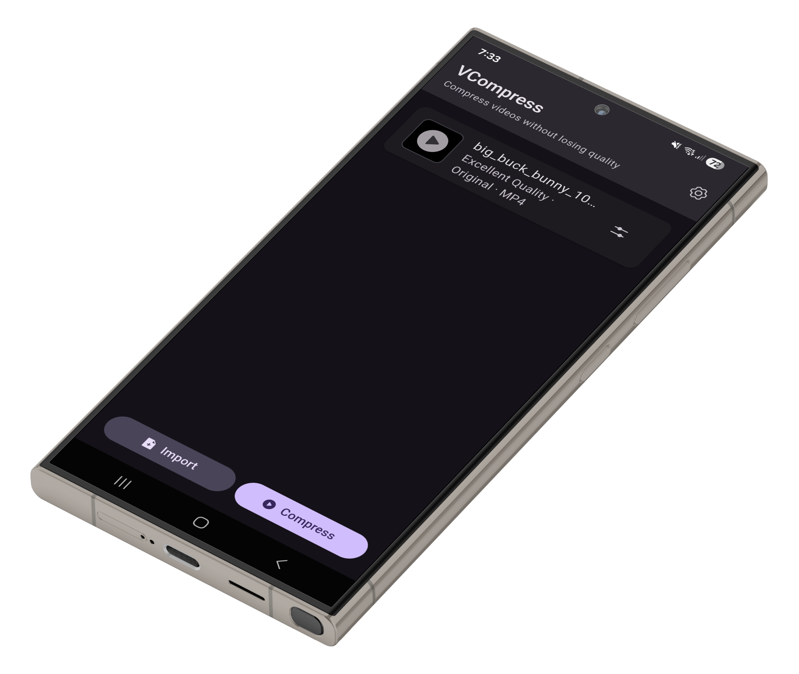
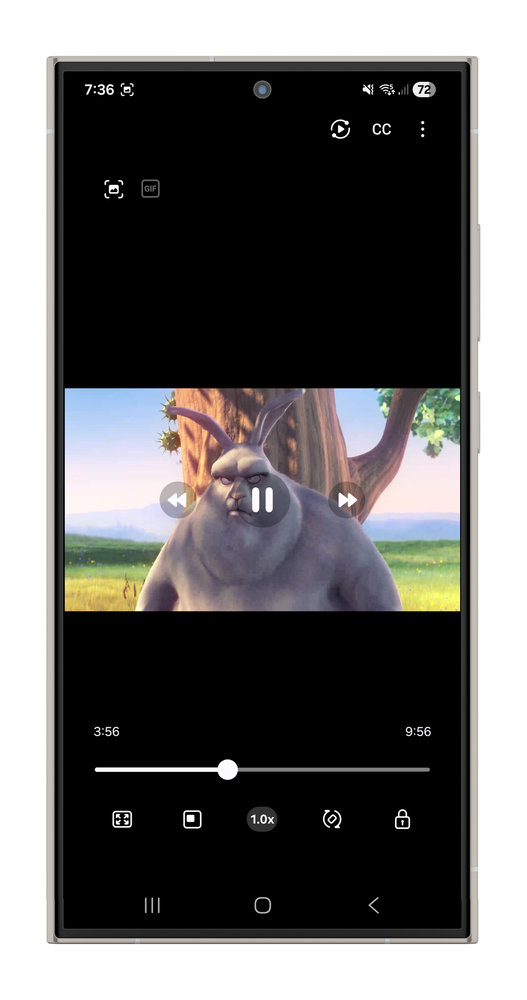

<div align="center">
  
</div>

# VCompress

[](https://opensource.org/licenses/MIT)
[](https://flutter.dev)
[](https://dart.dev)
[](https://www.android.com)
[](https://github.com/roymejia2217/VCompress/releases)
[](https://github.com/roymejia2217/VCompress)

A powerful Android video compression application built with Flutter. VCompress provides intelligent video optimization with hardware acceleration, batch processing, and real-time progress tracking.

**Platforms**: Android (7.0+) | **Languages**: [English](README.md) | [Español](README_ES.md) | [Français](README_FR.md) | [Italiano](README_IT.md)

---

## Table of Contents

- [Features](#features)
- [User Interface Preview](#user-interface-preview)
- [Technical Specifications](#technical-specifications)
- [Architecture](#architecture)
- [Installation & Setup](#installation--setup)
- [Usage](#usage)
- [Development](#development)
- [Testing](#testing)
- [Performance Optimizations](#performance-optimizations)
- [Compatibility](#compatibility)
- [Troubleshooting](#troubleshooting)
- [Dependency Management](#dependency-management)
- [Architecture Decisions](#architecture-decisions)
- [Contributing](#contributing)
- [FAQ](#faq)
- [License](#license)
- [Support](#support)

---

## Features

### Core Compression
- **Multiple Compression Algorithms**: VP8, VP9, H.264, H.265 with hardware acceleration support
- **Batch Processing**: Compress multiple videos simultaneously with intelligent queueing
- **Real-time Progress Tracking**: Live progress indicators for import and compression operations
- **Smart Resolution Selection**: Predefined profiles (720p, 1080p, 2K, 4K) with custom options
- **Format Flexibility**: Support for MP4, WebM, MKV output containers

### Advanced Features
- **Hardware Detection**: Automatic detection of device capabilities (CPU cores, RAM, codec support)
- **FFmpeg Integration**: Industry-standard video processing with ffmpeg_kit_flutter_new
- **Thumbnail Generation**: Automatic video thumbnail extraction with caching
- **Metadata Extraction**: Complete video analysis (duration, resolution, codec, fps)
- **File Management**: Safe file replacement with backup options, MediaStore URI resolution
- **Notification System**: Real-time compression progress notifications

### User Experience
- **Material Design 3**: Modern, responsive UI with dynamic color theming
- **Multi-language Support**: Spanish (es), English (en), French (fr) with Flutter Intl
- **Localized Settings**: Theme mode (light/dark/system), language selection, custom save directory
- **Dark Mode**: Full Material 3 dark theme support with Flex Color Scheme
- **Accessibility**: Semantic labels, keyboard navigation, screen reader support

---

## User Interface Preview

### Compression Workflow

VCompress features an intuitive Material Design 3 interface that guides users through the video compression process:

| **Step 1: Import** | **Step 2: Configure** | **Step 3: Process** | **Step 4: Results** |
|:---:|:---:|:---:|:---:|
| Browse and select videos from your device | Configure compression settings (algorithm, resolution, format) | Monitor real-time compression progress | View compressed videos and export |
|  |  |  |  |

### Advanced Features

**Fine-tuned Settings** - Expand configuration modal for granular control over compression parameters


**Native Playback** - Preview compressed videos using your device's native media player


---

## Technical Specifications

### System Requirements

| Component | Minimum | Recommended |
|-----------|---------|-------------|
| **Android** | 7.0 (API 24) | 12.0+ (API 31+) |
| **Dart** | 3.6.0 | 3.8.1 |
| **Flutter** | 3.19.0 | 3.32.8 |
| **RAM** | 2GB | 4GB+ |
| **Storage** | 150MB free | 500MB+ free |

### Supported Codecs

**Video Codecs**: VP8, VP9, H.264, H.265, AV1 (hardware-dependent)  
**Audio Codecs**: AAC, Opus, Vorbis  
**Containers**: MP4, WebM, MKV  
**Pixel Formats**: Yuv420, Yuv422, Yuv444  

### Hardware Acceleration

| Codec | Support |
|-------|---------|
| **H.264** | MediaCodec (hardware) |
| **H.265** | MediaCodec (hardware) |
| **VP9** | MediaCodec (hardware on 8.0+) |

---

## Architecture

### Technology Stack

```
State Management:    Riverpod 2.6.1 (FutureProvider, StateNotifier)
Navigation:         GoRouter 16.2.0 (type-safe routing)
UI Framework:       Flutter Material 3
Video Processing:   FFmpeg (ffmpeg_kit_flutter_new 4.1.0)
Storage:            SharedPreferences + Path Provider
Icons:              Phosphor Flutter 2.1.0
Theming:            Flex Color Scheme 8.3.1
Localization:       Flutter Intl (.arb files)
Permissions:        Permission Handler 12.0.1
File Picking:       File Picker 10.3.3
Thumbnails:         Video Thumbnail 0.5.6
```

### Project Structure

```
lib/
├── core/                              # Core architecture & utilities
│   ├── accessibility/                # Accessibility helpers
│   ├── constants/                    # Constants, design tokens, animations
│   ├── error/                        # Error handling & definitions
│   ├── extensions/                   # Dart extensions
│   ├── hardware/                     # Hardware detection logic
│   ├── logging/                      # Logging utilities
│   ├── performance/                  # Memory management
│   ├── result/                       # Result type pattern
│   ├── services/                     # Core services
│   └── validation/                   # Validation logic
│
├── data/                              # Data layer implementation
│   ├── repositories/                 # Repository implementations
│   └── services/                     # Data services (FFmpeg, MediaStore, etc.)
│
├── domain/                            # Domain layer (Business Logic)
│   ├── models/                       # Domain models
│   ├── repositories/                 # Repository interfaces
│   └── usecases/                     # Application use cases
│
├── l10n/                              # Localization files (.arb)
│
├── models/                            # Shared data models
│
├── providers/                         # State management (Riverpod)
│
├── router/                            # Navigation configuration
│
├── services/                          # Global services (Permissions)
│
├── ui/                                # User Interface (Widgets & Pages)
│   ├── home/                         # Home screen
│   ├── process/                      # Processing screen
│   ├── settings/                     # Settings screen
│   ├── theme/                        # Theme configuration
│   └── widgets/                      # Reusable widgets
│
├── utils/                             # General utilities
│
└── main.dart                          # Application entry point
```

android/                               # Android-specific configuration
├── app/src/main/
│   ├── AndroidManifest.xml           # Android manifest
│   ├── java/                         # Java source code
│   ├── kotlin/                       # Kotlin source code
│   └── res/
│       ├── mipmap-*/                 # App icons (mdpi, hdpi, xhdpi, xxhdpi, xxxhdpi)
│       ├── values/                   # Strings, colors, themes
│       └── play_store_512.png        # Play Store icon
│
├── build.gradle                      # Project-level Gradle
└── settings.gradle                   # Gradle settings

test/                                  # Test suite (5 categories)
├── accessibility/                    # Accessibility tests
├── integration/                      # End-to-end tests
├── performance/                      # Performance benchmarks
├── unit/                             # Unit tests
└── widget/                           # Widget tests
```

### Key Services Explained

#### VideoProcessorService / VideoProcessorServiceMobile
Manages FFmpeg-based video compression. Constructs FFmpeg commands based on settings, monitors progress, and handles platform-specific optimizations.

```dart
// Example usage
final processor = ref.watch(videoProcessorProvider);
await processor.compressVideo(
  inputPath: '/path/to/video.mp4',
  outputPath: '/path/to/output.mp4',
  settings: VideoSettings(
    preset: CompressionAlgorithm.h265,
    resolution: VideoResolution.uhd4k,
    format: VideoFormat.mp4,
  ),
  onProgress: (current, total) {
    print('Progress: $current/$total');
  },
);
```

#### VideoMetadataService / VideoMetadataServiceMobile
Extracts video metadata using FFprobe: duration, resolution, codec, fps. Generates thumbnails for UI preview.

#### HardwareDetectionService
Detects device capabilities (CPU cores, RAM, available codecs) for optimization decisions.

```dart
final hw = ref.watch(hardwareProvider);
if (hw.supportsH265) {
  // Use H.265 for better compression
}
```

#### FFmpegProgressService
Real-time progress tracking from FFmpeg output parsing. Converts bitrate/time into percentage completion.

#### NotificationService
Sends system notifications for compression progress and events.

#### CacheService
Singleton for in-memory and disk caching (SharedPreferences). Stores thumbnails, metadata, recent files.

---

## Installation & Setup

### Prerequisites
- **Flutter**: 3.19.0+ ([install guide](https://flutter.dev/docs/get-started/install))
- **Dart**: 3.6.0+ (bundled with Flutter)
- **Android SDK**: API 24+ for Android builds

### Clone Repository
```bash
git clone https://github.com/roymejia2217/VCompress.git
cd VCompressor
```

### Install Dependencies
```bash
flutter pub get
```

### Generate Localization Files
```bash
flutter gen-l10n
```

### Run Application

**Android Device/Emulator**:
```bash
flutter run -d android
# or for specific device
flutter run -d <device_id>
```

**Release Build (Android)**:
```bash
flutter build apk --release
# or app bundle for Play Store
flutter build appbundle --release
```

---

## Usage

### Basic Workflow

1. **Import Videos**: Tap the import button, select one or multiple videos
2. **Configure Compression**: Choose algorithm, resolution, format (individual or batch)
3. **Monitor Progress**: Watch real-time progress bars during import and compression
4. **Save Compressed Videos**: Files save to configured directory (default: Downloads/VCompress)

### Compression Settings

| Setting | Options | Notes |
|---------|---------|-------|
| **Algorithm** | VP8, VP9, H.264, H.265, AV1 | H.265 best compression, H.264 best compatibility |
| **Resolution** | 720p, 1080p, 2K, 4K, Custom | Downscaling reduces file size significantly |
| **Format** | MP4, WebM, MKV | MP4 most compatible, WebM smallest |
| **Quality** | 18-28 CRF | Lower = better quality, larger files |
| **FPS** | Original, 15, 24, 30, 60 | Reducing fps saves bandwidth |

### Batch Processing

Enable batch mode to compress multiple videos with consistent settings:
1. Select multiple videos during import
2. Configure settings once (applied to all)
3. Queue processes automatically
4. Monitor all progress in single list

### Storage Configuration

Change save directory in Settings > Storage > Change Folder. Custom locations supported on Android 11+.

---

## Development

### Code Style

- **Format**: Run `flutter format lib/` regularly
- **Analysis**: Keep `flutter analyze` warnings at 0
- **Comments**: Explain *why*, not *what* (code shows what)
- **Naming**: Descriptive names with suffixes for specialized classes (e.g., `_mobile.dart` for platform-specific)

### Common Workflows

**Bug Fix Workflow**:
```bash
# 1. Identify issue
flutter analyze

# 2. Locate relevant files
grep -r "search_term" lib/

# 3. Fix code
# (edit files)

# 4. Format and analyze
flutter format lib/
flutter analyze

# 5. Test fix
flutter test
flutter run -d android
```

**Feature Implementation**:
```bash
# 1. Create/modify files
# (edit files)

# 2. Format code
flutter format lib/

# 3. Analyze for issues
flutter analyze

# 4. Run tests
flutter test test/unit/  # or specific test file

# 5. Test in app
flutter run -d android
```

### State Management with Riverpod

**FutureProvider** (async data, read-only):
```dart
final videoMetadataProvider = FutureProvider.family((ref, String path) async {
  return await ref.watch(videoMetadataServiceProvider).extractMetadata(path);
});
```

**StateNotifierProvider** (mutable state):
```dart
final videoConfigProvider = StateNotifierProvider.family((ref, VideoTask task) {
  return VideoConfigNotifier(task);
});
```

**Watching providers**:
```dart
final metadata = ref.watch(videoMetadataProvider(videoPath));
metadata.when(
  data: (data) => Text('Duration: ${data.duration}'),
  loading: () => CircularProgressIndicator(),
  error: (err, st) => Text('Error: $err'),
);
```

---

## Testing

### Test Categories

| Category | Location | Purpose |
|----------|----------|---------|
| **Unit** | `test/unit/` | Service logic, algorithms, calculations |
| **Widget** | `test/widget/` | UI components, rendering, interactions |
| **Integration** | `test/integration/` | End-to-end flows, multiple services |
| **Accessibility** | `test/accessibility/` | Screen readers, keyboard navigation |
| **Performance** | `test/performance/` | Benchmarks, memory usage, frame rates |

### Run Tests

```bash
# All tests
flutter test

# Specific category
flutter test test/unit/

# Specific test file
flutter test test/unit/services/video_processor_service_test.dart

# With coverage
flutter test --coverage
```

### Example Unit Test

```dart
void main() {
  group('VideoSettings', () {
    test('defaults should be valid', () {
      final settings = VideoSettings.defaults();
      expect(settings.preset, CompressionAlgorithm.h265);
      expect(settings.resolution, VideoResolution.hd1080);
    });

    test('quality should be in valid range', () {
      final settings = VideoSettings(quality: 18);
      expect(settings.quality, inInclusiveRange(18, 28));
    });
  });
}
```

---

## Performance Optimizations

### Memory Management

- **Thumbnail Caching**: Disk cache for video thumbnails (CacheService)
- **Lazy Loading**: Lists use `ListView.builder` for efficient memory
- **Memory Monitoring**: `MemoryManager` tracks heap usage, triggers cleanup
- **Metadata Caching**: Extract once, reuse across operations

### FFmpeg Optimization

- **Hardware Acceleration**: Uses MediaCodec on Android for H.264/H.265
- **Profile-Guided Encoding**: FFmpeg preset (ultrafast, superfast, fast) based on device
- **Chunk Processing**: Processes video in segments for large files
- **Parallel Tasks**: Multiple compressions with intelligent queueing

### UI Performance

- **Provider Selectors**: Watch only needed state (`.select()`)
- **Repaint Boundaries**: Progress bars don't rebuild entire list
- **Const Constructors**: Widgets marked `const` where possible
- **Image Caching**: Thumbnails cached with ImageCache

### Network & Storage

- **Local Processing**: All video processing happens on-device
- **Efficient I/O**: SharedPreferences for settings, Path Provider for files
- **MediaStore Integration**: Uses Android MediaStore for proper URI resolution

---

## Compatibility

### Android Versions

| Version | API | Status | Notes |
|---------|-----|--------|-------|
| **7.0** | 24 | Supported | Minimum version |
| **8.0** | 26 | Supported | VP9 hardware support |
| **9.0** | 28 | Supported | Improved scoped storage |
| **11.0+** | 30+ | Recommended | Full scoped storage |
| **14.0+** | 34+ | Full support | Latest APIs |

---

## Troubleshooting

### Common Issues

#### Build Fails: "Android SDK not found"
```bash
# Ensure Flutter can find Android SDK
flutter config --android-sdk /path/to/android-sdk

# Run diagnostics
flutter doctor
```

#### FFmpeg Errors During Compression
```bash
# Check FFmpeg installation
ffmpeg -version

# Test on device
flutter run -d android --verbose
```

#### Timeout During Video Import (50+ files)
The import timeout scales automatically: **30 + (file count) seconds**. For 100 files, timeout is 130 seconds.

#### Out of Memory on Large Videos
- Close other apps
- Reduce target resolution
- Clear app cache: Settings > Clear Cache

#### Dark Mode Not Working
Ensure device has:
1. "Use system theme" enabled in Settings
2. System dark mode activated (Android 9+)

---

## Dependency Management

### Core Dependencies

| Package | Version | Purpose |
|---------|---------|---------|
| **flutter** | 3.32.8 | UI framework |
| **flutter_riverpod** | 2.6.1 | State management |
| **go_router** | 16.2.0 | Navigation |
| **ffmpeg_kit_flutter_new** | 4.1.0 | Video processing |
| **video_thumbnail** | 0.5.6 | Thumbnail generation |
| **file_picker** | 10.3.3 | File selection |
| **permission_handler** | 12.0.1 | Permission requests |
| **flex_color_scheme** | 8.3.1 | Material 3 theming |
| **phosphor_flutter** | 2.1.0 | Icons (600+) |
| **path_provider** | 2.1.5 | App directories |
| **shared_preferences** | 2.5.3 | Persistent settings |
| **crypto** | 3.0.7 | Cryptographic utilities |
| **package_info_plus** | 8.0.2 | Package information |
| **logger** | 2.6.2 | Logging |

### Dev Dependencies

| Package | Version | Purpose |
|---------|---------|---------|
| **flutter_test** | SDK | Testing framework |
| **integration_test** | SDK | Integration tests |
| **flutter_lints** | 4.0.0 | Code analysis |

Check `pubspec.yaml` for complete dependency list.

---

## Architecture Decisions

### Why Riverpod?
- Type-safe without BuildContext
- Excellent async handling (FutureProvider)
- Scoped state with `.family`
- Testable without mocking frameworks

### Why GoRouter?
- Type-safe route parameters
- Deep linking support
- Declarative routing tree
- Nested navigation for tablets

### Why FFmpeg?
- Industry standard (used by YouTube, Instagram)
- Supports 100+ codecs/containers
- Hardware acceleration support
- Active community and updates

### Platform-Specific Implementation
- **_mobile.dart** files for Android-specific logic (MediaCodec, MediaStore, MediaStore URI resolution)
- Optimized for Android 7.0+ with hardware acceleration support

---

## Contributing

Contributions welcome! Please:

1. **Fork repository** and create feature branch
2. **Code** following established patterns (see Development section)
3. **Test** thoroughly (unit, widget, integration)
4. **Format** with `flutter format lib/`
5. **Analyze** with `flutter analyze` (0 warnings)
6. **Submit PR** with clear description

### Areas for Contribution

- [ ] Additional compression algorithms
- [ ] More language translations
- [ ] Performance benchmarks
- [ ] Accessibility improvements

---

## FAQ

**Q: How long does video compression typically take?**

Compression time depends on video size, resolution, target codec, and device hardware. A 100MB video may take 2-5 minutes on a mid-range device. Hardware acceleration (H.264/H.265 with MediaCodec) significantly reduces processing time.

**Q: What is the difference between the compression algorithms (VP8, VP9, H.264, H.265)?**

H.265 provides best compression ratio but slower encoding. H.264 balances compression and speed. VP9 offers web optimization. VP8 is older, rarely used. Choose H.265 for maximum size reduction, H.264 for compatibility and speed.

**Q: Will the original video file be deleted after compression?**

No. VCompress saves the compressed video to a new file. Your original remains untouched. You can enable overwrite in Settings if desired.

**Q: Why does my device get hot during compression?**

Video compression is CPU/GPU intensive. On older devices, sustained processing generates heat. This is normal. Reduce target resolution or split large videos into segments to minimize heat generation.

**Q: What permissions does VCompress need and why?**

Storage: Read/write video files. Notifications: Show compression progress. Camera/Microphone: Not required; app doesn't use them. Permissions requested only as needed.

**Q: Can I compress videos in background or while using other apps?**

Yes. VCompress runs compression as a background service. You can navigate away, use other apps, or lock the device. Progress notifications keep you updated.

**Q: Which video formats are supported as input?**

Any format supported by FFmpeg: MP4, MKV, AVI, MOV, FLV, WebM, 3GP, and others. Codecs must be recognized by your device's video decoder.

**Q: How much free storage do I need for compression?**

Temporary space needed during compression is approximately equal to the input file size. Save location must have sufficient space for the output file. Clear app cache if space is low.

**Q: Why is compression slower on Android 7.0 compared to newer versions?**

Android 7.0 lacks some hardware acceleration features available in 8.0+. Software encoding is slower. Update if possible, or reduce resolution/quality for faster processing.

**Q: What should I do if compression fails or gets stuck?**

Check available storage (>200MB recommended). Ensure video file is not corrupted. Restart the app. For persistent issues, report with device info (`flutter doctor` output) and video details.

**Q: Can I compress to multiple formats in one pass?**

No. Each compression creates one output file in one format. For multiple outputs, compress multiple times with different settings.

---

## License

MIT License - See LICENSE file for details.

---

## Support

### Documentation
- [CLAUDE.md](./CLAUDE.md) - Development guidelines and architecture decisions
- [Flutter Documentation](https://flutter.dev/docs)
- [FFmpeg Documentation](https://ffmpeg.org/documentation.html)

### Issues & Feedback
- GitHub Issues: [VCompress Issues](https://github.com/roymejia2217/VCompress/issues)
- Bug Reports: Include `flutter doctor` output and steps to reproduce
- Feature Requests: Describe use case and expected behavior

## Version History

| Version | Date | Highlights |
|---------|------|-----------|
| **2.0.5** | 2026-01-21 | F-Droid compatibility (reproducible builds), disabled DependencyInfoBlock |
| **2.0.4** | 2025-11-11 | Dependency upgrades, ProGuard rules improvements for F-Droid |
| **2.0.3** | 2025-11-09 | Enabled ProGuard minification, FFmpeg Kit configuration fixes |
| **2.0.2** | 2025-11-08 | Added complete Italian (it) localization |
| **2.0.1** | 2025-11-07 | Maintenance release, localization consistency fixes |
| **2.0.0** | 2025-11-07 | Initial Release, Material Design 3, Multi-language, Hardware Acceleration |

---

**Built with ❤️ using Flutter**

Questions? Open an issue or visit the [GitHub repository](https://github.com/roymejia2217/VCompress).
